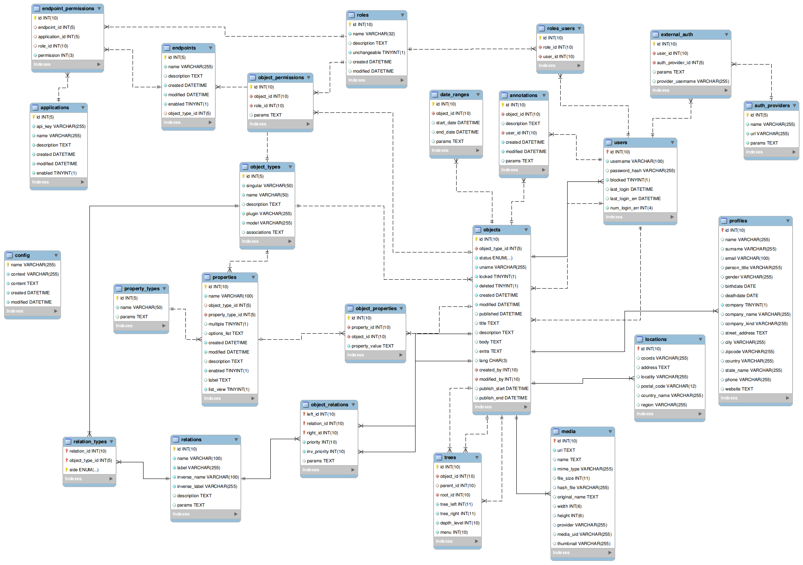

Database
========

Schema
------

BEdita4 schema files are located in ``BEdita/Core/config/schema`` folder where you will find
 * ``be4-schema.json`` - vendor independent DB schema in JSON format
 * ``tables.json`` - ordered list of tables for create/update operations
 * ``be4-schema-<vendor>.sql`` - vendor specific SQL schema file (only MySQL supported at the moment - ``be4-schema-mysql.sql``)
 
ER Diagram
----------

