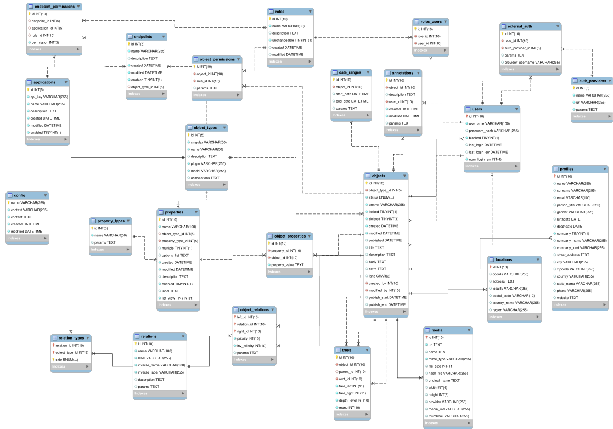

Database
========

Schema
------

BEdita4 uses `CakePHP Migrations <https://book.cakephp.org/3.0/en/migrations.html>`_ plugin for schema creation and update.
Schema migration files are located in ``plugins/BEdita/Core/config/Migrations`` and they are basically PHP files that describe
database schema evolution.

With simple shell commands you can check migration status and perform schema update.
See also :ref:`shell:db_admin` shell command to perform schema check and initialization.

A MySQL schema file, provided for convenience only, is available in ``plugins/BEdita/Core/config/schema/be4-schema-mysql.sql``.
It's not used anywhere in BEdita but it may be used as a quick reference.

ER Diagram
----------

A simple ER diagram is displayed here to give you a glimpse of BEdita4 core schema.
Don't use it as a reference though: we will keep an updated version of this diagram, but some tables or fields may still be missing.



Migrations
----------

The recommended way to create a schema migration is to use the `bake` shell.  
In your terminal, run:

```shell
bin/cake bake resources_migration MigrationsName
```

This command will generate two files in your `config/Migrations` folder:
* `YYYYMMDDHHMMSS_MigrationName.php`: this is the file used as reference in the phinxlog
* `YYYYMMDDHHMMSS_MigrationName.yml`: this will contain the real content of the migration

Then, you can use the yaml syntax to describe the migration:
```yaml
# MigrationName migration
---

#create:

#update:

#remove:
```

In the following example, we are going to add a property to the `profiles` model, as well as a relation with the `documents` model:

```yaml
# AddAuthorStuff migration
---

create:
  properties:
    - name: pen_name
      object: profiles
      property: text
  relations:
    - name: author_of
      label: Author of
      inverse_name: authored_by
      inverse_label: Authored by
      description: Author relation
      left:
        - profiles
      right:
        - documents
```
